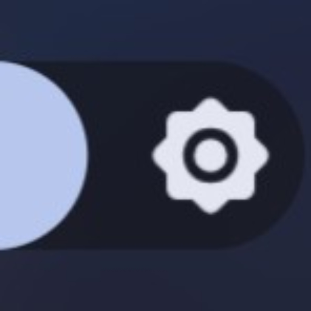
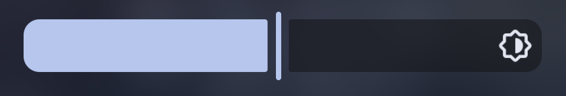
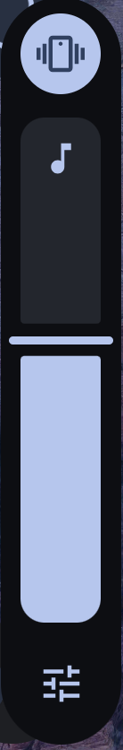
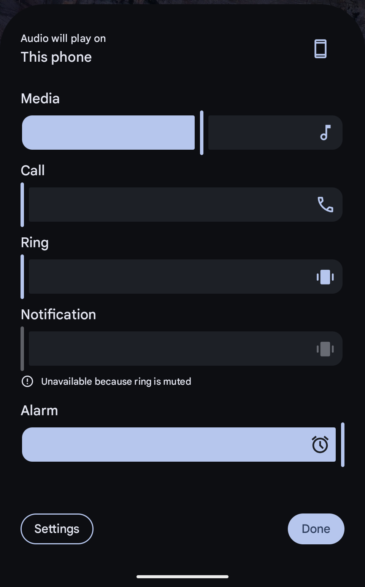
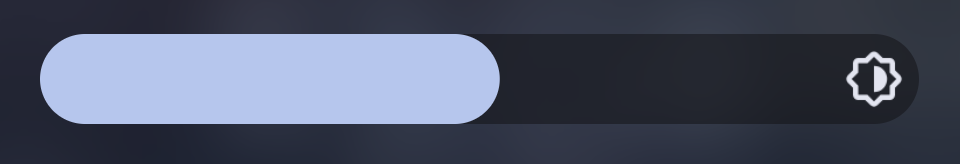
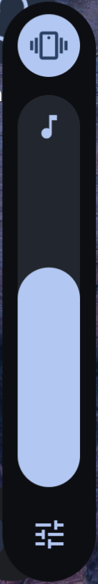
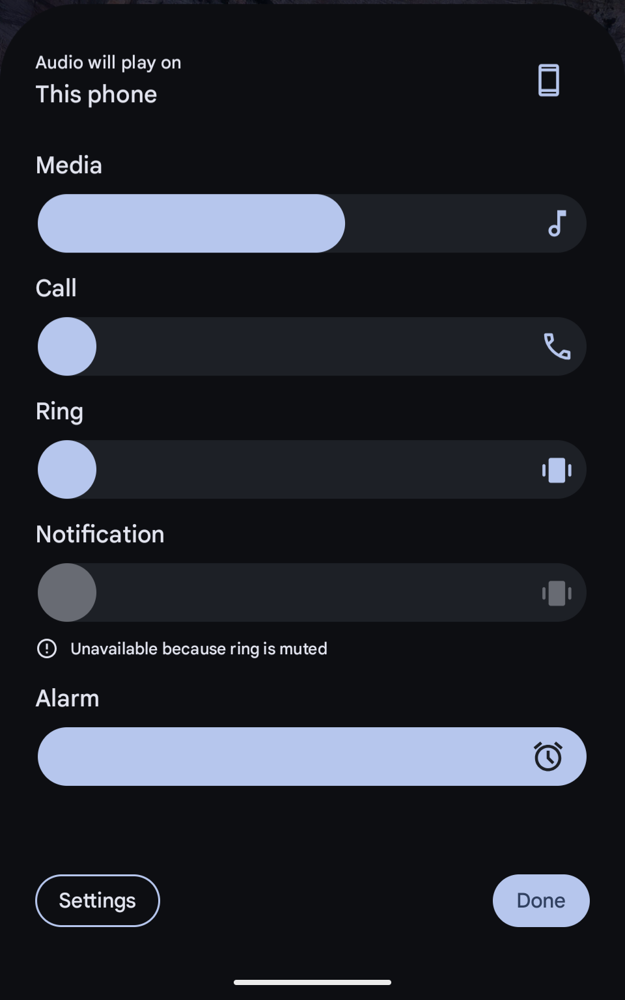
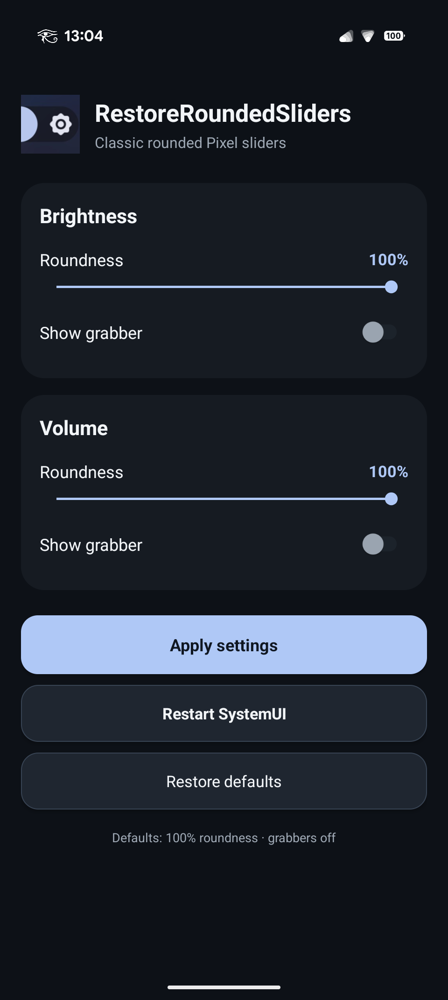

#  RestoreRoundedSliders

RestoreRoundedSliders is an Xposed module for the Pixel SystemUI to make the Android 16/17 Pixel brightness and volume sliders rounded again.

It is not a total 100% accurate reproduction of the pre Android 16 slider style, but more of a mix of the modern and the old style (screenshots below).


## Disclaimer

```
/*
 * Your warranty is void.
 * I am not responsible for bricked devices, dead SD cards, thermonuclear war,
 * or you getting fired because the alarm app failed.
 * Please do some research if you have any concerns about features included
 * in the products you find here before flashing it!
 * YOU are choosing to make these modifications.
 */
```

This module modifies SystemUI at runtime through Xposed hooks. A SystemUI update can break compatibility or cause SystemUI to restart repeatedly.

Keep a way to disable Xposed modules from recovery / your root environment before testing new versions.

## Screenshots

### Before 

&nbsp;&nbsp;&nbsp;&nbsp;&nbsp;&nbsp; 

### After

&nbsp;&nbsp;&nbsp;&nbsp;&nbsp;&nbsp; 

## In-App configuration

<p align="center">
  
</p>

By default, the following configuration is applied to restore classic rounded sliders without grabbers:

- Brightness roundness: **100%**
- Brightness grabber: **OFF**
- Volume roundness: **100%**
- Volume grabber: **OFF**

These settings can be adjusted individually in the App to change the appearance.

Applying settings automatically restarts SystemUI.

## Compatibility

As of now, **this module has only been tested on a Google Pixel 9 Pro with Android 17 (build CP2A.260805.005)**, but it should work on all Pixel devices with Android 17. 

It has not been tested with Android 16 (which has the same slider style) yet, so I can't say for sure if it is compatible with it or not.

**Feedback from different devices and/or with Android 16 would be appreciated.**

## Requirements

- Rooted Android device
- A working Xposed-compatible framework such as [Vector](https://github.com/JingMatrix/Vector)
- Pixel Android 17 / compatible `SystemUIGoogle` build
- Root access for the configuration app

The Xposed module itself is scoped only to:

```text
com.android.systemui
```

The configuration app requests root so it can save its settings through `Settings.Global` and restart SystemUI after changes are applied.

## Installation

1. Install the RestoreRoundedSliders APK.
2. Open Vector / your Xposed manager.
3. Enable **RestoreRoundedSliders**.
4. Make sure the module is scoped to **System UI (`com.android.systemui`)**.
5. Reboot the device, or restart SystemUI.
6. Grant root access to the RestoreRoundedSliders app and open it.
7. Configure brightness and volume roundness / grabber settings.
8. Tap **Apply settings**.

## How it works

RestoreRoundedSliders hooks Pixel SystemUI's Jetpack Compose / Material 3 slider rendering through the Xposed API.

Instead of replacing the entire SystemUI component, it modifies the relevant slider geometry at runtime. This allows the module to retain Android's native:

- colors
- value handling
- animations
- haptic feedback
- brightness behavior
- volume behavior

while changing the visual track shape.

The project currently uses the **legacy Xposed API** via a bundled Xposed API 82 JAR (`api-82.jar`, SHA-256: `f48c635f1c7469fdec0e00ad2ea0b7a6b2f5b55065784a35b7ca3a84615e8e25`) for compilation and includes an `assets/xposed_init` entry point.

## Building from source

### Requirements

- Android SDK
- JDK 17 or 21 recommended
- Gradle wrapper included with the project

Clone the repository and run:

```bash
./gradlew assembleDebug
```

The debug APK will be generated under:

```text
app/build/outputs/apk/debug/
```

For public releases, use a consistently signed release APK. **Keep the same signing key for every future release**, otherwise Android will not allow users to update the installed module normally.

## Debugging

Useful log filter:

```bash
adb logcat | grep RestoreRoundedSliders
```

or:

```bash
adb logcat | grep REALVOL
```

To manually restart SystemUI:

```bash
adb shell su -c 'killall com.android.systemui'
```

## Package

```text
dev.restoreroundedsliders
```

## Contributing

Bug reports are welcome, especially from other Pixel devices and Android 17 builds.

When reporting an issue, please include:

- device model
- Android build number
- Vector / Xposed framework version
- whether brightness, compact volume, or mixer is affected
- relevant `adb logcat` output

Because this module depends on internal SystemUI implementation details, reports from different Pixel builds are especially useful.
